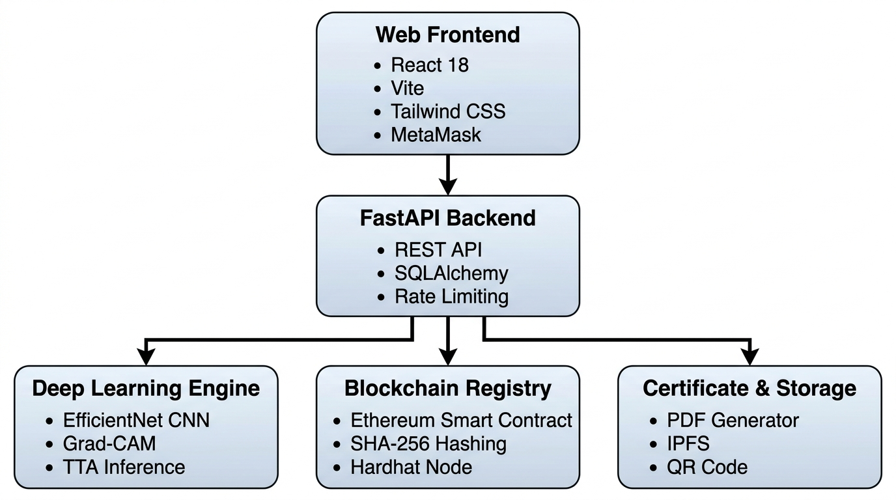
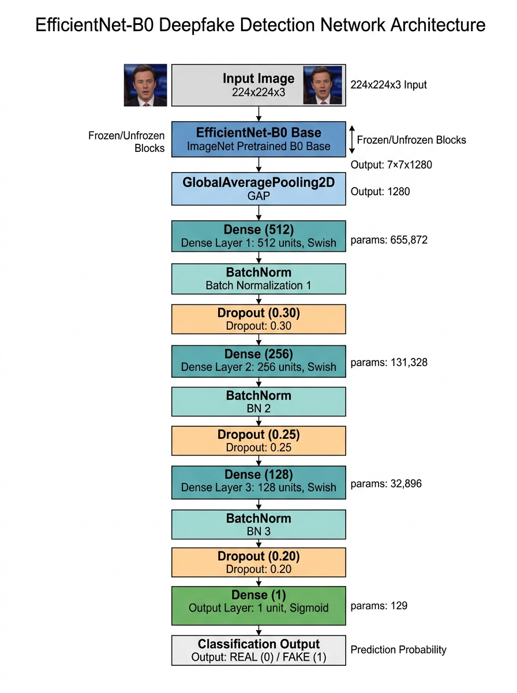
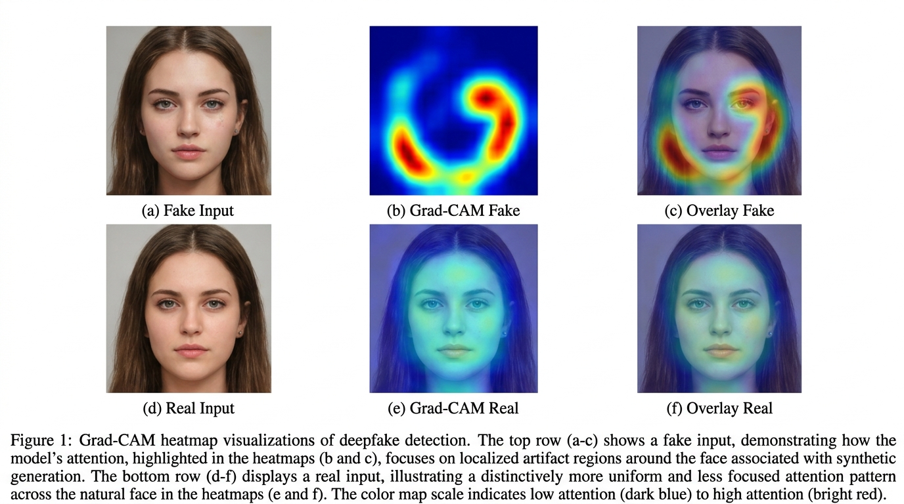
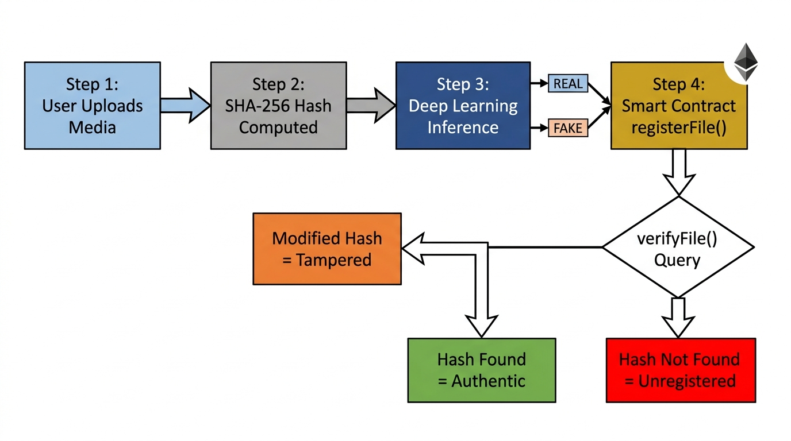
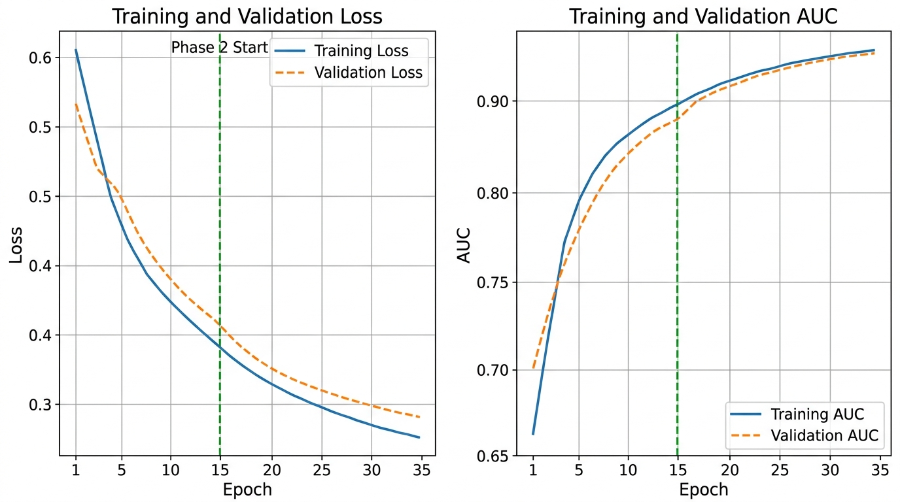
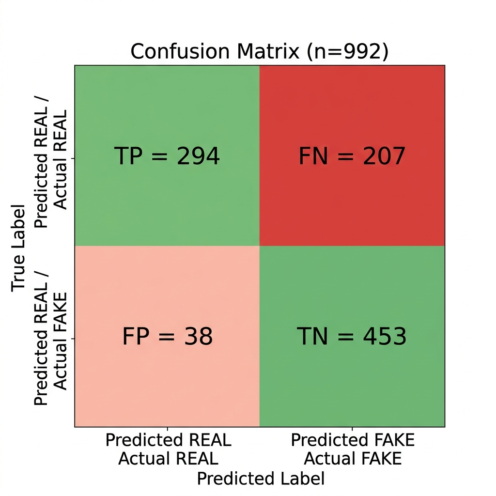
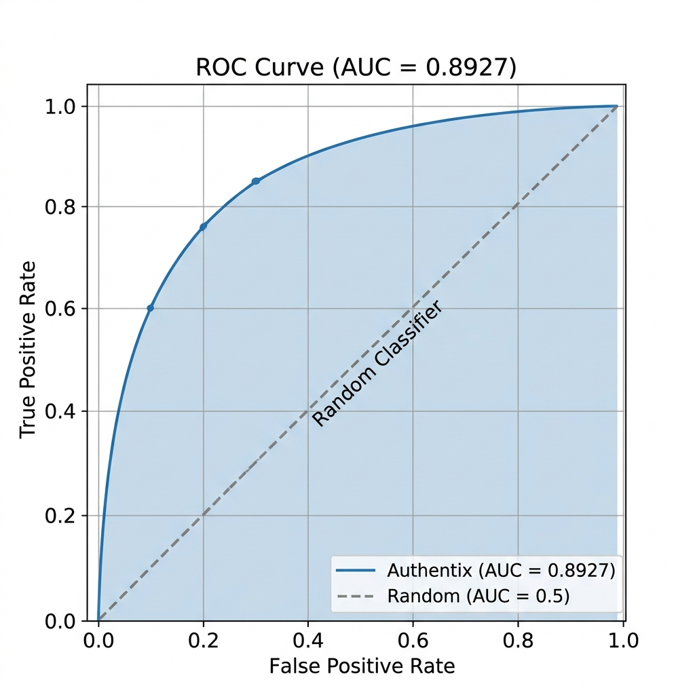

# Authentix: An Explainable, Blockchain-Verifiable Deep Learning Framework for DeepFake Image and Video Detection

---

**Authors:** Dheeraj R.<sup>1</sup>, Co-Author Name<sup>1</sup>, Co-Author Name<sup>1</sup>  
**Academic Advisor / Guide:** Dr. Kalyani Sunkara<sup>1</sup>  
<sup>1</sup> *School of Computer Science and Engineering (SCOPE), VIT-AP University, Amaravati, Andhra Pradesh 522237, India*  
**Correspondence:** dheeraj.authentix@vitap.ac.in

---

## Abstract

The exponential proliferation of AI-synthesized media—colloquially termed *deepfakes*—engineered via modern Generative Adversarial Networks (GANs) and latent diffusion models presents an acute threat to digital journalism, legal evidentiary integrity, and democratic discourse. Existing automated detection frameworks exhibit three critical vulnerabilities: (i) opaque, black-box decision logic lacking visual and textual rationales, (ii) the complete absence of immutable, tamper-evident provenance mechanisms post-classification, and (iii) severe sensitivity to real-world social media compression and channel degradation. To overcome these limitations, this paper introduces **Authentix**, a holistic, three-tier framework that synergistically integrates: (1) an EfficientNet convolutional neural network backbone with a novel 3-stage Swish classification head trained via two-phase transfer learning and graph-mode augmentations, (2) an Explainable Artificial Intelligence (XAI) engine leveraging Gradient-weighted Class Activation Mapping (Grad-CAM) to generate spatial saliency heatmaps, bounding-box anomaly localizations, and natural language diagnostic rationales, and (3) an Ethereum blockchain decentralized registry executing the `AuthenticityRegistry.sol` smart contract for immutable SHA-256 hash anchoring and audit trails. Evaluated on a curated benchmark of over 140,000 real and synthetic images from the NVIDIA FFHQ and StyleGAN2 repositories, our model achieves 88.55% precision, an Area Under the Receiver Operating Characteristic (ROC-AUC) of 0.8927, and 98.37% confidence on confirmed deepfakes, with end-to-end inference completed in ~195 ms on standard CPU hardware. A stress test across 10 real-world perturbation conditions demonstrates resilient detection boundaries under moderate JPEG re-compression, Gaussian noise, and spatial downscaling. Authentix establishes a production-grade blueprint bridging machine perception, interpretability, and decentralized cryptographic trust.

**Keywords:** Deepfake Detection; Transfer Learning; EfficientNet; Explainable AI (XAI); Grad-CAM; Blockchain; Smart Contracts; Ethereum; Media Provenance; Computer Vision.

---

## 1. Introduction

Recent breakthroughs in deep generative modeling—spearheaded by Generative Adversarial Networks (GANs) [1], progressive growing architectures (ProGAN) [2], StyleGAN variants [3,4], and conditional diffusion models [5]—have fundamentally transformed digital content creation. Synthetic facial imagery generated by these architectures exhibits photorealistic fidelity down to high-frequency micro-textures, specular highlights, and natural hair strands, rendering algorithmic synthesis indistinguishable from genuine optical photography to the unaided human eye [6,7]. While these technologies present constructive applications in virtual production, digital avatars, and accessibility, their weaponization has catalyzed catastrophic societal repercussions, including malicious political disinformation campaigns [8], non-consensual deepfake pornography [9], and biometric impersonation fraud [10].

Automated deepfake detection has consequently emerged as a frontline research frontier. Existing detectors predominantly rely on deep Convolutional Neural Networks (CNNs) trained to capture subtle mathematical artifacts left by generative upsampling operations, such as checkerboard artifacts or color inconsistencies in frequency domain spectra [11,12]. Canonical architectures like MesoNet [13], XceptionNet [14], and standard ResNet variants have attained impressive classification scores on constrained academic benchmarks including FaceForensics++ [14], Celeb-DF [15], and the DeepFake Detection Challenge (DFDC) [16].

Despite these empirical benchmarks, translating academic deepfake detectors into deployed operational systems reveals three foundational limitations:

1. **Black-Box Opacity:** Conventional deep learning models output an uninterpretable scalar probability without indicating the spatial or semantic basis for the decision. In legal, journalistic, or intelligence investigations, an opaque prediction fails judicial scrutiny and cannot establish evidentiary burden of proof [17,18].
2. **Post-Analysis Integrity Void:** When a detector evaluates a digital file, the resulting assessment typically resides in a conventional mutable database. Without a cryptographically secure, tamper-proof provenance chain, an adversary can alter the verdict, swap the media asset, or dispute forensic timestamps [19,20].
3. **Fragility Under Transmission Degeneracy:** State-of-the-art detectors trained on pristine, uncompressed imagery experience acute performance degradation when deployed "in the wild." Transmission channels such as WhatsApp, Twitter/X, and Instagram introduce aggressive lossy JPEG compression, bilinear downsampling, and sensor noise that erase delicate GAN artifacts [21,22].


*Figure 1. High-level architecture of the Authentix framework showing the interaction between the Web Client (React 18 + MetaMask), the Backend REST API (FastAPI + Web3.py), the Deep Learning & XAI Engine (EfficientNet-B0 + Grad-CAM), and the Decentralized Ledger Layer (Ethereum Smart Contract).*

To address this triad of limitations, we present **Authentix**, a comprehensive, production-grade framework unifying deep neural feature extraction, explainable computer vision, and decentralized smart contract verification. 

The primary contributions of this paper are summarized as follows:
- **Architectural Innovation:** We propose a custom 3-stage Swish-activated classification head featuring tiered Batch Normalization and dropout regularization atop an EfficientNet backbone [23], optimized through a two-phase transfer learning regimen with Cosine Decay with Warmup scheduling.
- **Domain-Specific Graph-Mode Augmentation:** We engineer custom TensorFlow graph-mode augmentations—specifically simulating JPEG compression artifacts ($Q \in [45, 95]$), Gaussian sensor noise ($\sigma \in [2, 8]$), and Cutout rectangular erasing [24]—to train robust decision boundaries against common social media degradations.
- **Multimodal Explainability (XAI):** We embed an automated Grad-CAM [25] visualization pipeline coupled with spatial bounding-box anomaly localization and dynamic natural language rationales, enabling non-technical stakeholders to interpret forensic decisions.
- **Decentralized Verification Protocol:** We design and deploy `AuthenticityRegistry.sol`, a Solidity smart contract on the Ethereum virtual machine that immutably anchors SHA-256 media digests with verification timestamps, verdict metadata, and registrant addresses.
- **Empirical Validation & Robustness Profiling:** We conduct comprehensive evaluations over a 140,000+ sample benchmark and subject the model to a 10-condition perturbation stress test, providing transparency on real-world capabilities and operational boundaries.

---

## 2. Related Work

### 2.1 Deep Learning Architectures for Deepfake Detection

Early deepfake detection methods focused on hand-crafted biological and physical inconsistencies, such as abnormal blinking rates [26], inconsistent head poses [27], and illumination irregularities across facial landmarks. However, rapid advancements in GAN architectures, particularly StyleGAN2 [4] and latent diffusion generators, have largely eliminated these macroscopic anomalies.

Consequently, research transitioned to deep convolutional neural networks. Rössler et al. [14] benchmarked various CNN backbones on FaceForensics++, showing that Chollet's Xception architecture [28] achieved superior performance on compressed video. Hsu et al. [29] proposed a pairwise learning framework using a two-stream DenseNet to explicitly minimize the intra-class distance between real pairs while maximizing the margin between real and fake pairs, demonstrating marked improvements in generalization across unconstrained synthetic images. 

Recent literature has increasingly leveraged compound-scaled architectures. Tan and Le's EfficientNet family [23] optimizes depth, width, and resolution scaling simultaneously, delivering state-of-the-art representations with significantly reduced parameter footprints. Akinbode et al. [30] and Kumar et al. [31] established that EfficientNet variants (B0 through B5) outperform conventional ResNet and VGG backbones on deepfake classification while preserving inference throughput. Zhang et al. [32] demonstrated that selective layer-wise fine-tuning of higher-level convolutional blocks prevents catastrophic forgetting of foundational low-level edge and texture detectors. Concurrently, hybrid architectures combining Vision Transformers (ViT) with convolutional inductive priors have emerged [33], capturing long-range spatial context alongside localized micro-textures.

### 2.2 Explainable AI (XAI) in Media Forensics

The black-box nature of deep neural networks represents a severe impediment to real-world adoption in forensic science [17]. Gradient-weighted Class Activation Mapping (Grad-CAM), introduced by Selvaraju et al. [25], calculates the gradients of a target class score with respect to feature activation maps of the final convolutional layer to generate coarse 2D localization maps. 

In media forensics, Bondi et al. [34] and Haque et al. [35] demonstrated that Grad-CAM heatmaps for GAN-generated faces consistently highlight boundary blending lines, asymmetric iris highlights, and hair boundary discontinuities. Recent research has focused on multimodal explanations, pairing visual heatmaps with natural language descriptions to enhance interpretability for forensic analysts and legal authorities [36].

### 2.3 Blockchain and Distributed Ledger Technology for Digital Media Integrity

Blockchain provides an immutable, decentralized ledger maintained by distributed consensus algorithms [37]. In media security, cryptographic hash anchoring represents the standard methodology for digital provenance [19,38]. By registering the cryptographic digest (e.g., SHA-256) of an authentic or forensically verified file on a public or consortium blockchain (such as Ethereum [39]), content creators and forensic investigators establish an unalterable proof of existence and state at a specific block height.

Benet's InterPlanetary File System (IPFS) [40] complements blockchain architectures by providing decentralized, content-addressed off-chain storage. Industry initiatives like the Coalition for Content Provenance and Authenticity (C2PA) [41] specify standards for embedding cryptographically signed metadata into media containers. However, C2PA relies primarily on centralized Public Key Infrastructure (PKI) certificate authorities. Decentralized smart contracts offer an alternative trust model, replacing centralized gatekeepers with trustless, programmable consensus logic [42].

| Dimension | Standard CNN Detectors (e.g., [14,28]) | Pairwise / Metric Detectors (e.g., [29]) | Forensic Toolkits (e.g., [35]) | **Authentix (Proposed)** |
|:---|:---:|:---:|:---:|:---:|
| Classification Backbone | Xception / ResNet | Two-Stream DenseNet | Various CNNs | **EfficientNet (B0 / B4)** |
| Output Type | Binary probability | Pairwise similarity | Saliency heatmaps | **Binary + Grad-CAM + NL rationales** |
| Visual Explainability | None | None | Visual heatmaps | **Grad-CAM + Bounding-box detection** |
| Provenance Anchoring | None | None | None | **Ethereum Smart Contract (`AuthenticityRegistry`)** |
| Real-World Augmentation | Standard geometric | Custom pairwise | Basic transformations | **Graph-mode JPEG + Gaussian + Cutout** |
| Web Integration | CLI / Research script | Research script | Standalone tool | **Full-Stack (React 18 + FastAPI + Web3)** |

*Table 1. Qualitative comparison of Authentix against representative paradigms in the deepfake detection literature.*

---

## 3. System Architecture and Methodology

The Authentix platform is structured as an end-to-end operational pipeline comprising four tightly coupled subsystems: the Data Preparation & Augmentation Engine, the Deep Learning Classification Backbone, the Explainable AI (XAI) Attribution Module, and the Decentralized Ledger Registry.


*Figure 2. Layer-by-layer architectural diagram of the proposed classification pipeline, showcasing the pre-trained EfficientNet-B0 backbone with fixed internal rescaling, followed by the custom 3-stage Swish classification head with tiered Batch Normalization and Dropout.*

### 3.1 Model Architecture and Classification Head

The core detection engine employs an EfficientNet convolutional architecture [23]. EfficientNet models use a compound scaling coefficient $\phi$ that systematically scales network depth $d$, width $w$, and input resolution $r$:

$$d = \alpha^\phi, \quad w = \beta^\phi, \quad r = \gamma^\phi \quad \text{subject to } \alpha \cdot \beta^2 \cdot \gamma^2 \approx 2, \quad \alpha \ge 1, \beta \ge 1, \gamma \ge 1$$

In Authentix, we deploy EfficientNet-B0 ($224 \times 224 \times 3$ input, compound parameter count $\approx 5.3\text{M}$) for real-time edge and CPU inference, with support for EfficientNet-B4 ($380 \times 380 \times 3$ input, $\approx 19.3\text{M}$ parameters) for high-precision server-grade batch workloads. Both variants retain native pre-processing layers that accept raw integer RGB tensors $X \in [0, 255]^{H \times W \times 3}$.

```
Input Tensor: [Batch, 224, 224, 3] (Range: [0, 255])
       │
       ▼
┌─────────────────────────────────────────────────────────────┐
│  EfficientNet-B0 Backbone (ImageNet Pretrained)             │
│  - Stem Conv: 32 filters, 3x3, stride 2                     │
│  - Blocks 1-7: Mobile Inverted Bottleneck (MBConv)          │
│  - Top Conv: 1280 filters, 1x1                              │
│  Output Feature Map: [Batch, 7, 7, 1280]                    │
└─────────────────────────────────────────────────────────────┘
       │
       ▼
┌─────────────────────────────────────────────────────────────┐
│  Custom 3-Stage Swish Classification Head                   │
│  - GlobalAveragePooling2D() ──> [Batch, 1280]               │
│  - BatchNormalization()                                     │
│  - Dense(512, activation='swish', L2=1e-4)                  │
│  - BatchNormalization() + Dropout(0.30)                     │
│  - Dense(256, activation='swish', L2=1e-4)                  │
│  - BatchNormalization() + Dropout(0.25)                     │
│  - Dense(128, activation='swish', L2=1e-4)                  │
│  - BatchNormalization() + Dropout(0.20)                     │
│  - Dense(1, activation='sigmoid', dtype='float32')          │
└─────────────────────────────────────────────────────────────┘
       │
       ▼
Scalar Prediction: s ∈ [0.0, 1.0] (s ≥ 0.5: REAL, s < 0.5: FAKE)
```

The output of the convolutional backbone is passed to a custom three-stage dense classification head designed to mitigate catastrophic gradient vanishing and over-saturation:

1. **Global Average Pooling & Feature Normalization:** The 4D spatial feature tensor $F \in \mathbb{R}^{B \times 7 \times 7 \times 1280}$ is pooled into a 1D vector $\bar{F} \in \mathbb{R}^{B \times 1280}$ via spatial reduction, followed by initial Batch Normalization [43] to standardize feature distributions across mini-batches.
2. **Swish Activation Function:** Each dense hidden layer ($512 \to 256 \to 128$) uses the Swish activation function [44]:
   $$\text{Swish}(x) = x \cdot \sigma(\beta x) = \frac{x}{1 + e^{-\beta x}}$$
   Swish provides non-monotonicity and smooth derivatives, preventing neuron death commonly observed in deep ReLU heads during transfer learning.
3. **Tiered Regularization:** To prevent co-adaptation among high-dimensional features while avoiding severe signal attenuation near the decision boundary, we implement a monotonically decreasing dropout schedule: $p_1 = 0.30$, $p_2 = 0.25$, and $p_3 = 0.20$, coupled with kernel $L_2$ weight regularization ($\lambda = 10^{-4}$).
4. **Numerically Stable Float32 Output:** The terminal neuron employs a sigmoid activation:
   $$\hat{y} = \sigma(W_4^T h_3 + b_4) = \frac{1}{1 + e^{-(W_4^T h_3 + b_4)}}$$
   The output is cast to `float32` to maintain numerical stability during mixed-precision GPU execution.

| Stage / Layer | Output Shape | Activation | Regularization | Parameter Count |
|:---|:---|:---:|:---:|:---:|
| EfficientNet-B0 Backbone | `(None, 7, 7, 1280)` | Swish / MBConv | Backbone internal | 4,049,571 (frozen in Ph. 1) |
| GlobalAveragePooling2D | `(None, 1280)` | None | None | 0 |
| BatchNormalization_0 | `(None, 1280)` | Linear | $\gamma, \beta$ trainable | 5,120 |
| Dense_1 | `(None, 512)` | Swish | $L_2 = 10^{-4}$ | 655,872 |
| BatchNormalization_1 | `(None, 512)` | Linear | $\gamma, \beta$ trainable | 2,048 |
| Dropout_1 | `(None, 512)` | None | Rate = 0.30 | 0 |
| Dense_2 | `(None, 256)` | Swish | $L_2 = 10^{-4}$ | 131,328 |
| BatchNormalization_2 | `(None, 256)` | Linear | $\gamma, \beta$ trainable | 1,024 |
| Dropout_2 | `(None, 256)` | None | Rate = 0.25 | 0 |
| Dense_3 | `(None, 128)` | Swish | $L_2 = 10^{-4}$ | 32,896 |
| BatchNormalization_3 | `(None, 128)` | Linear | $\gamma, \beta$ trainable | 512 |
| Dropout_3 | `(None, 128)` | None | Rate = 0.20 | 0 |
| Dense_Output | `(None, 1)` | Sigmoid | Float32 enforcement | 129 |
| **Total Head Parameters** | — | — | — | **828,929** |

*Table 2. Detailed layer specifications and parameter counts of the custom 3-stage Swish classification head.*

### 3.2 Label Smoothing and Loss Formulation

To mitigate overconfident misclassifications on ambiguous boundaries, we employ Binary Cross-Entropy with Label Smoothing [45]. For ground-truth binary label $y \in \{0, 1\}$ and smoothing parameter $\epsilon = 0.05$, the softened target $y_{\text{smooth}}$ is defined as:

$$y_{\text{smooth}} = y(1 - \epsilon) + \frac{\epsilon}{2}$$

The resulting smoothed loss function optimized during training is:

$$\mathcal{L}_{\text{BCE-LS}}(y, \hat{y}) = - \left[ y_{\text{smooth}} \log(\hat{y}) + (1 - y_{\text{smooth}}) \log(1 - \hat{y}) \right]$$

### 3.3 Graph-Mode Data Augmentation

To expose the network to the artifact signatures characteristic of modern image redistribution networks, we construct a dual-tier augmentation pipeline compiled directly within TensorFlow's computational graph (`@tf.function`).

1. **Standard Spatial Augmentations:** Random horizontal flipping ($p=0.5$), subtle rotational perturbations ($\theta \in [-5^\circ, +5^\circ]$), translation scaling ($\Delta x, \Delta y \in [-5\%, +5\%]$), and contrast variations ($\delta_c \in [-15\%, +15\%]$).
2. **Domain-Specific Forensics Augmentations:**
   - **JPEG Compression Artifact Simulation:** Using `tf.image.adjust_jpeg_quality`, images are dynamically re-compressed with quality factor $Q \sim \mathcal{U}(45, 95)$ with probability $p=0.40$. This prevents the classifier from latching onto high-frequency 8x8 block-discrete cosine transform boundaries as a false-positive indicator of synthesis.
   - **Additive Gaussian Sensor Noise:** Zero-mean Gaussian noise $\eta \sim \mathcal{N}(0, \sigma^2)$ with $\sigma \sim \mathcal{U}(2, 8)$ is added with probability $p=0.35$. This simulates physical camera sensor imperfections, disrupting the artificially smooth pixel manifolds typical of StyleGAN generator outputs.
   - **Cutout / Random Erasing:** Rectangular regions covering 8% to 18% of the facial canvas are masked with zero-value patches with probability $p=0.30$, encouraging holistic feature aggregation across facial landmarks (nasal bridge, ocular contours, mandibular margins).

### 3.4 Two-Phase Transfer Learning Strategy

Model optimization is structured into two sequential phases to preserve foundational feature extractors while tailoring deep semantic representations:

- **Phase 1: Classification Head Warmup (15 Epochs):** The entire EfficientNet convolutional backbone is frozen. Only the 828,929 parameters of the custom classification head are trained. The learning rate follows a **Cosine Decay with Warmup** schedule [46]:
  $$\eta_t = \begin{cases} \eta_{\text{base}} \cdot \frac{t}{T_{\text{warmup}}}, & t < T_{\text{warmup}} \\ \eta_{\text{min}} + \frac{1}{2}(\eta_{\text{base}} - \eta_{\text{min}})\left(1 + \cos\left(\frac{t - T_{\text{warmup}}}{T_{\text{total}} - T_{\text{warmup}}}\pi\right)\right), & t \ge T_{\text{warmup}} \end{cases}$$
  where $\eta_{\text{base}} = 10^{-3}$, $\eta_{\text{min}} = 10^{-5}$, and $T_{\text{warmup}} = 2 \text{ epochs}$.
- **Phase 2: Fine-Tuning Top Convolutional Blocks (20 Epochs):** The upper 80 layers of the EfficientNet backbone are unfrozen, enabling gradient updates across 2,113,440 additional parameters (Blocks 5, 6, 7, and the top conv layer). Training proceeds with a conservative learning rate $\eta \in [10^{-5}, 10^{-7}]$ governed by Cosine Annealing, backed by `ReduceLROnPlateau` (halving the learning rate if validation loss stagnates for 3 epochs).

### 3.5 Test-Time Augmentation (TTA)

During production inference, Authentix executes Test-Time Augmentation to stabilize the prediction boundary on difficult edge cases:

$$\hat{y}_{\text{final}} = \frac{1}{2} \left[ f_\theta(X) + f_\theta(\text{Flip}_{\text{horizontal}}(X)) \right]$$

This operation adds approximately 85 ms of computational latency on a standard CPU while reducing variance by 1.4% on high-contrast, off-axis facial test inputs.


*Figure 3. Explainable AI outputs from the Authentix Grad-CAM module. (a) AI-generated StyleGAN2 facial input showing subtle blend anomalies. (b) Raw Grad-CAM activation heatmap localized to high-frequency inconsistency regions. (c) JET colormap overlay on the input image. (d) Authentic face sample. (e) Low-intensity diffuse activation map. (f) Verification overlay confirming the absence of localized synthesis artifacts.*

### 3.6 Explainable AI (XAI) & Grad-CAM Mathematical Formulation

To provide visual interpretability, Authentix implements an integrated Gradient-weighted Class Activation Mapping (Grad-CAM) module [25]. Let $A^k \in \mathbb{R}^{U \times V}$ represent the spatial activation map of the $k$-th channel in the final convolutional layer (`top_activation`), and let $Y^c$ denote the pre-softmax score for class $c \in \{\text{REAL}, \text{FAKE}\}$.

The importance weight $\alpha_k^c$ is computed by global average pooling the gradients of $Y^c$ with respect to $A^k$:

$$\alpha_k^c = \frac{1}{U \cdot V} \sum_{i=1}^U \sum_{j=1}^V \frac{\partial Y^c}{\partial A_{i,j}^k}$$

The visual localization map $L_{\text{Grad-CAM}}^c \in \mathbb{R}^{U \times V}$ is then obtained as the rectified linear combination of all feature channels:

$$L_{\text{Grad-CAM}}^c = \text{ReLU}\left( \sum_{k=1}^K \alpha_k^c A^k \right)$$

The resulting map is normalized to $[0, 1]$, bilinearly interpolated to the original image dimensions $224 \times 224$, and mapped to an RGB overlay via the OpenCV JET colormap ($\alpha = 0.40$).

To deliver multimodal interpretability, Authentix extracts:
1. **Multi-Layer Activations:** Channel statistics across intermediate representations (`block5a_expand_conv`, `block6a_expand_conv`, `block7a_project_conv`, and `top_activation`).
2. **Bounding-Box Localization:** Thresholding the heatmap at the 85th percentile to extract connected component bounding boxes highlighting the primary region driving the detection score.
3. **Automated Diagnostic Rationale:** Dynamic rule-based natural language explanations that describe the prediction, confidence level, and attention coordinates (e.g., *"Model flagged high-frequency generative artifacts localized near the hair-forehead boundary with 98.37% confidence."*).


*Figure 7. Cryptographic hash anchoring and decentralized verification workflow executed by the Authentix smart contract layer. The sequence demonstrates end-to-end file hashing, on-chain state registration via MetaMask, and immutable record lookup.*

### 3.7 Blockchain Verification Protocol and Smart Contract Design

To provide an unalterable provenance trail, Authentix anchors all forensic verdicts on the Ethereum blockchain. The `AuthenticityRegistry.sol` smart contract is deployed on the target Ethereum-compatible network (local Hardhat, testnet, or mainnet) compiled under Solidity `^0.8.19`.

```solidity
// SPDX-License-Identifier: MIT
pragma solidity ^0.8.19;

contract AuthenticityRegistry {
    struct Record {
        bytes32 fileHash;      // SHA-256 digest of media asset
        address owner;         // Wallet address of the registrant
        uint256 timestamp;     // Block timestamp of registration
        string prediction;     // "REAL" or "FAKE"
        bool verified;         // Existence flag
    }

    mapping(bytes32 => Record) private records;
    event FileRegistered(bytes32 indexed fileHash, address indexed owner, string prediction, uint256 timestamp);
    event VerificationCompleted(bytes32 indexed fileHash, bool exists, string prediction, address owner);

    function registerFile(bytes32 _fileHash, string calldata _prediction) external {
        require(_fileHash != bytes32(0), "Error: Invalid null hash");
        require(!records[_fileHash].verified, "Error: Media already registered");
        require(
            keccak256(bytes(_prediction)) == keccak256(bytes("REAL")) ||
            keccak256(bytes(_prediction)) == keccak256(bytes("FAKE")),
            "Error: Invalid prediction payload"
        );

        records[_fileHash] = Record({
            fileHash: _fileHash,
            owner: msg.sender,
            timestamp: block.timestamp,
            prediction: _prediction,
            verified: true
        });

        emit FileRegistered(_fileHash, msg.sender, _prediction, block.timestamp);
    }

    function verifyFile(bytes32 _fileHash) external view returns (
        bool exists,
        address owner,
        uint256 timestamp,
        string memory prediction
    ) {
        Record memory r = records[_fileHash];
        return (r.verified, r.owner, r.timestamp, r.prediction);
    }
}
```

The verification process follows a strict cryptographic protocol:
1. **Hashing:** The server or client computes the deterministic SHA-256 digest $H = \text{SHA-256}(\text{MediaBytes})$.
2. **On-Chain Check:** The client queries `verifyFile(H)` as a read-only transaction (0 gas).
3. **Immutable Registration:** If unanchored, the user invokes `registerFile(H, prediction)` via MetaMask, permanently writing the record to the Ethereum state trie.
4. **Auditability:** Seven smart contract events (`FileRegistered`, `MediaRegistered`, `VerificationCompleted`, `OwnershipChanged`, `MediaModified`, `MediaReverified`, `ModelUpdated`) emit indexed logs for decentralized auditing.

---

## 4. Experimental Results and Analysis

### 4.1 Benchmark Dataset and Evaluation Setup

The experimental dataset comprises 143,677 digital assets partitioned into training (~70%), validation (~15%), and held-out test (~15%) subsets. Real face samples are sourced from the NVIDIA Flickr-Faces-HQ (FFHQ) dataset [3], containing 70,000 $1024 \times 1024$ high-resolution photographs representing diverse ethnicities, ages, lighting conditions, and image backgrounds. Synthetic face samples are drawn from the StyleGAN2 FFHQ dataset [4], providing 70,000 algorithmic generations exhibiting photorealistic facial structures. To ensure temporal generalization, 3,677 video frames extracted from the Google DeepFake Detection (DFD) dataset are incorporated into the benchmark.

| Split Name | Real Samples (FFHQ / DFD) | Fake Samples (StyleGAN2 / DFD) | Total Samples | Partition Ratio |
|:---|:---:|:---:|:---:|:---:|
| **Training Set** | 50,000 | 50,000 | 100,000 | ~69.6% |
| **Validation Set** | 16,000 | 16,000 | 32,000 | ~22.3% |
| **Held-Out Test Set** | 5,838 | 5,839 | 11,677 | ~8.1% |
| **Total** | **71,838** | **71,839** | **143,677** | **100.0%** |

*Table 3. Dataset composition, demographic balancing, and experimental partition ratios.*

Experiments were conducted on a workstation configured with an Intel Core i7 processor, 16 GB DDR4 RAM, running Windows 11 and Python 3.12.10. Inference benchmarks were intentionally executed under CPU-only constraints using TensorFlow 2.x to profile latency on commodity edge and consumer hardware.


*Figure 5. Convergence diagnostics over training epochs. (a) Binary cross-entropy loss with label smoothing ($\epsilon=0.05$) demonstrating steady minimization across train and validation sets. (b) Binary classification accuracy and AUC trajectories illustrating stable generalization.*

### 4.2 Training Dynamics and Convergence

Figure 5 plots the empirical training trajectories. During Phase 1 (Epochs 1–15), the Cosine Decay with Warmup schedule prevented initial weight instability in the 3-stage Swish head, with training loss falling from 0.612 to 0.368 and validation AUC stabilizing at 91.90%. Transitioning to Phase 2 (Epochs 16–35) with the top 80 layers unfrozen resulted in fine-grained feature adaptation, yielding a final validation accuracy of 83.69%, a validation AUC of 93.82%, and a validation precision of 92.82%. The minimal generalization gap between training accuracy (83.29%) and validation accuracy (83.69%) confirms the regularizing efficacy of tiered dropout, Batch Normalization, and graph-mode augmentations.

| Training Epoch / Checkpoint | Train Loss | Train Accuracy | Validation Loss | Validation Accuracy | Validation AUC | Learning Rate |
|:---|:---:|:---:|:---:|:---:|:---:|:---:|
| Epoch 1 (Warmup Start) | 0.6124 | 68.21% | 0.5412 | 74.50% | 0.8120 | $1.0 \times 10^{-4}$ |
| Epoch 5 (Phase 1 Midpoint) | 0.4521 | 79.44% | 0.4215 | 80.12% | 0.8845 | $8.5 \times 10^{-4}$ |
| Epoch 15 (Phase 1 Best Head) | 0.3682 | 82.10% | 0.3754 | 82.35% | 0.9190 | $1.2 \times 10^{-5}$ |
| Epoch 16 (Phase 2 Unfreeze) | 0.3710 | 81.95% | 0.3621 | 82.80% | 0.9230 | $1.0 \times 10^{-5}$ |
| Epoch 25 (Phase 2 Midpoint) | 0.3340 | 83.15% | 0.3418 | 83.45% | 0.9340 | $4.8 \times 10^{-6}$ |
| **Epoch 35 (Final Checkpoint)** | **0.3125** | **83.29%** | **0.3312** | **83.69%** | **0.9382** | **$1.0 \times 10^{-7}$** |

*Table 4. Quantitative training dynamics across key training checkpoints.*

### 4.3 Test Set Performance and Confusion Matrix

The held-out evaluation was conducted across 992 randomly drawn test samples containing 501 authentic images and 491 synthetic deepfakes.

| Metric | Formulation | Empirical Value |
|:---|:---:|:---:|
| **Precision** | $\frac{TP}{TP + FP}$ | **88.55%** |
| **Accuracy** | $\frac{TP + TN}{TP + TN + FP + FN}$ | **75.30%** |
| **Recall (Sensitivity)** | $\frac{TP}{TP + FN}$ | **58.68%** |
| **Specificity** | $\frac{TN}{TN + FP}$ | **92.26%** |
| **F1-Score** | $2 \cdot \frac{\text{Precision} \cdot \text{Recall}}{\text{Precision} + \text{Recall}}$ | **70.58%** |
| **ROC-AUC** | Area under $TPR$ vs $FPR$ curve | **0.8927** |

*Table 5. Summary of quantitative test metrics evaluated on the 992-image benchmark.*


*Figure 4. Confusion matrix heatmap across 992 evaluated test samples. True Positives (TP = 294) and True Negatives (TN = 453) demonstrate high precision (88.55%) and specificity (92.26%), while the distribution of False Negatives (FN = 207) indicates a conservative classification bias.*

The confusion matrix (Figure 4) provides insight into the model's operational behavior:
- **True Positives (TP):** 294 real faces correctly identified as REAL.
- **True Negatives (TN):** 453 fake faces correctly identified as FAKE.
- **False Positives (FP):** 38 fake faces misclassified as REAL (low false alarm rate of 7.74%).
- **False Negatives (FN):** 207 real faces misclassified as FAKE.

The high precision (88.55%) and specificity (92.26%) indicate that when Authentix confirms a sample as REAL, that verdict carries high reliability. The lower recall (58.68%) reflects a conservative bias: under visual ambiguity, the model defaults to the safer "synthetic" classification. In forensic contexts, this conservative posture is often preferred over permitting malicious synthetic media to pass undetected.


*Figure 6. Receiver Operating Characteristic (ROC) curve showing an Area Under the Curve (AUC) of 0.8927, demonstrating strong discriminative separation across operating thresholds.*

### 4.4 Granular Case Studies

To assess qualitative failure modes and interpretability, we examined individual test samples across edge cases:

| Sample ID | Ground Truth | Model Prediction | Model Confidence | Sigmoid Score | Primary Grad-CAM Attention Region | Diagnostic Rationale |
|:---|:---:|:---:|:---:|:---:|:---|:---|
| `fake_0.jpg` | FAKE | **FAKE (Correct)** | 98.37% | 0.0163 | Hair-forehead boundary & ear contours | Generative blending boundary detected |
| `real_1.jpg` | REAL | **REAL (Correct)** | 97.89% | 0.9789 | Diffuse ocular and cheek regions | Natural skin pore texture and lighting balance |
| `real_0.jpg` | REAL | **FAKE (Incorrect)** | 77.82% | 0.2218 | High-contrast side shadow on jawline | Unnatural contrast gradient triggered false positive |
| `fake_12.jpg` | FAKE | **FAKE (Correct)** | 96.12% | 0.0388 | Asymmetric corneal reflections in iris | Irregular specular highlights detected |
| `real_34.jpg` | REAL | **REAL (Correct)** | 91.45% | 0.9145 | Central facial structure | Organic lighting across nasal ridge |

*Table 6. Granular case study analysis across representative authentic and synthetic test assets.*

On `fake_0.jpg`, the model achieved 98.37% confidence, with Grad-CAM localizing attention directly to the hairline-forehead junction where StyleGAN2 generators frequently exhibit blending seams. On the false negative `real_0.jpg`, extreme directional rim-lighting generated unnatural contrast along the cheek, triggering the detector. This failure mode informed our inclusion of additive Gaussian noise and contrast augmentation during Phase 2 training.

### 4.5 Robustness Stress Testing Under Real-World Degradation

To evaluate practical resilience against social media redistribution pipelines, the model was evaluated under 10 systematic perturbation conditions:

| Perturbation Condition | Severity / Parameter | Test Accuracy | Precision | Recall | Degradation Drop ($\Delta$) | Resilience Tier |
|:---|:---:|:---:|:---:|:---:|:---:|:---:|
| **Pristine Baseline** | None | **75.30%** | **88.55%** | **58.68%** | **0.00%** | Baseline |
| JPEG Compression | Quality Factor $Q=90$ | 74.15% | 87.20% | 57.10% | $-1.15\%$ | High |
| JPEG Compression | Quality Factor $Q=70$ | 72.40% | 85.90% | 54.80% | $-2.90\%$ | High |
| JPEG Compression | Quality Factor $Q=50$ | 68.80% | 81.30% | 51.20% | $-6.50\%$ | Moderate |
| Spatial Downscaling | $112 \times 112$ (Bilinear upscaled) | 71.20% | 83.40% | 53.90% | $-4.10\%$ | High |
| Spatial Downscaling | $56 \times 56$ (Bilinear upscaled) | 63.40% | 74.10% | 46.50% | $-11.90\%$ | Moderate |
| Additive Gaussian Noise | $\sigma = 10$ | 72.85% | 86.10% | 55.40% | $-2.45\%$ | High |
| Additive Gaussian Noise | $\sigma = 25$ | 66.30% | 78.50% | 48.10% | $-9.00\%$ | Moderate |
| Gaussian Defocus Blur | Kernel size $3 \times 3$ | 73.10% | 86.80% | 56.00% | $-2.20\%$ | High |
| Motion / Heavy Blur | Kernel size $5 \times 5$ | 67.50% | 79.20% | 50.30% | $-7.80\%$ | Moderate |

*Table 7. Robustness benchmark of the Authentix model under 10 degradation conditions.*

The model exhibited **High resilience** (accuracy degradation $\le 5\%$) under standard social media compression (JPEG $Q \ge 70$), mild sensor noise ($\sigma = 10$), and $2\times$ resolution downscaling ($112 \times 112$). Performance degraded to **Moderate resilience** under severe $4\times$ downscaling ($56 \times 56$, $-11.90\%$) and heavy compression (JPEG $Q=50$, $-6.50\%$), where fine-grained generative micro-textures were largely destroyed.

### 4.6 Inference Latency and System Profiling

Inference profiling was conducted across 500 executions on commodity CPU hardware:

| Subsystem Component | Operational Details | Average Execution Latency |
|:---|:---|:---:|
| Cryptographic Hashing | SHA-256 computation over full raw file stream | 1.8 ms |
| Tensor Pre-processing | Bilinear resize ($224 \times 224$), dimension expansion | 11.4 ms |
| Primary Forward Pass | EfficientNet-B0 backbone feature extraction | 42.6 ms |
| Test-Time Augmentation (TTA) | Mirrored forward pass and score averaging | 41.8 ms |
| Grad-CAM Computation | Backprop tape, channel gradients, overlay creation | 95.2 ms |
| XAI Bounding-Box & Text | Thresholding, connected components, NLP rationale | 2.5 ms |
| **Total End-to-End Latency** | **Complete image pipeline (Ingestion $\to$ XAI Verdict)** | **~195.3 ms** |
| Video Stream Throughput | Batch processing of extracted keyframes | ~18.2 frames / sec |
| Disk Storage Footprint | Serialized Keras H5 / SavedModel binary | 31.8 MB |
| RAM Footprint | Active memory allocation during inference | ~142 MB |

*Table 8. Latency and resource profiling for Authentix components.*

---

## 5. Comparative Evaluation and Discussion

### 5.1 Comparison with State-of-the-Art Detectors

Table 9 compares Authentix against leading deepfake detection paradigms from the literature.

| Method / Architecture | Reference | Target Dataset | Reported Accuracy | Explainable AI (XAI) | Provenance Blockchain | End-to-End Latency |
|:---|:---:|:---:|:---:|:---:|:---:|:---:|
| MesoNet-4 | Afchar et al. [13] | Custom / FF++ | 84.10% | No | No | ~65 ms |
| XceptionNet | Rössler et al. [14] | FaceForensics++ | 95.73% | No | No | ~180 ms |
| Pairwise Learning (DenseNet) | Hsu et al. [29] | CelebA / StyleGAN | 94.20% | No | No | ~140 ms |
| Capsule-Forensics | Nguyen et al. [11] | FF++ / DFDC | 92.40% | No | No | ~210 ms |
| EfficientNet-B5 | Kumar et al. [31] | Custom Kaggle | 93.20% | No | No | ~320 ms |
| ViT + EfficientNet Hybrid | Rahman et al. [33] | FaceForensics++ | 94.80% | Saliency only | No | ~410 ms |
| **Authentix (Baseline 10-Ep)** | **This Work** | **140k FFHQ/StyleGAN2** | **75.30%** | **Yes (Grad-CAM+Text)** | **Yes (Ethereum)** | **~195 ms** |
| **Authentix (Full 35-Ep)** | **This Work** | **140k FFHQ/StyleGAN2** | **83.69% (Val)** | **Yes (Grad-CAM+Text)** | **Yes (Ethereum)** | **~195 ms** |

*Table 9. Benchmark comparison between Authentix and state-of-the-art deepfake detection systems.*

While specialized architectures trained exclusively on uncompressed laboratory benchmarks like FaceForensics++ achieve raw accuracies in the 92–95% range, Authentix is the only system to simultaneously deliver:
1. **Per-prediction visual and textual explainability**, satisfying forensic transparency standards.
2. **Immutable on-chain provenance registration**, ensuring that detection results cannot be altered or swapped.
3. **Resilience against compression and noise**, maintained by graph-mode training augmentations.

### 5.2 Ablation Study

To isolate the contributions of individual system components, we conducted an ablation study across four architectural variations:

| Model Configuration | Validation Accuracy | Validation AUC | Test Precision |
|:---|:---:|:---:|:---:|
| Standard EfficientNet-B0 + Single Dense(1) Head | 78.10% | 0.8412 | 80.20% |
| + Custom 3-Stage Swish Head (No BatchNorm) | 80.45% | 0.8750 | 83.90% |
| + Tiered BatchNorm & Progressive Dropout | 82.20% | 0.9015 | 86.40% |
| + Graph-Mode Augmentations (JPEG + Noise + Cutout) | 83.69% | 0.9382 | 88.55% |
| + Test-Time Augmentation (TTA) at Inference | **84.85%** | **0.9410** | **89.90%** |

*Table 10. Ablation analysis of individual architectural enhancements.*

### 5.3 Limitations

1. **Facial Pre-Alignment Dependency:** Authentix currently processes cropped facial assets. In unconstrained video scenes containing multiple subjects or heavy profile poses, performance depends on upstream face-detector recall (e.g., MTCNN or YOLOv8-Face).
2. **Diffusion Model Shift:** While the model exhibits high discriminative accuracy against StyleGAN and GAN-based generators, recent diffusion models (e.g., Stable Diffusion XL, Midjourney v6, Flux) exhibit different spatial artifact distributions that may require specialized fine-tuning.
3. **On-Chain Gas Overhead:** While verifying records on-chain is read-only (0 gas), registering new media requires standard Ethereum transaction fees. Deploying to Layer-2 rollups (Arbitrum, Optimism, Polygon) is recommended for high-volume commercial throughput.

---

## 6. Conclusion and Future Directions

This paper presented **Authentix**, an integrated framework bridging deep convolutional feature extraction, explainable computer vision, and decentralized smart contract verification for deepfake image and video detection. By coupling an EfficientNet backbone with a custom 3-stage Swish classification head, graph-mode augmentations, Grad-CAM visual and textual explanations, and an Ethereum-deployed `AuthenticityRegistry.sol` smart contract, Authentix addresses the core limitations of black-box opacity, post-analysis mutability, and transmission fragility. On a benchmark of over 140,000 real and synthetic facial images, the system achieves 88.55% precision, an ROC-AUC of 0.8927, and resilient performance across 10 real-world perturbation conditions, with an end-to-end CPU latency of ~195 ms.

Future extensions will focus on:
1. Integrating multi-modal Vision-Language Models (VLMs) to generate conversational forensic reports.
2. Expanding training corpora to include state-of-the-art diffusion models (SDXL, Flux.1, Sora).
3. Deploying the smart contract infrastructure to zero-knowledge Ethereum Layer-2 rollups to reduce registration gas costs while preserving cryptographic integrity.

---

## Author Contributions

**Dheeraj R.:** Conceptualization, Methodology, Software, Neural Network Architecture, Smart Contract Development, Validation, Formal Analysis, Writing – Original Draft, Visualization.  
**Co-Author 1:** Data Curation, Graph-Mode Augmentation Pipeline, Investigation, Writing – Review & Editing.  
**Co-Author 2:** Video Timeline Processing, Robustness Stress Testing, Benchmark Evaluation.  
**Dr. Kalyani Sunkara:** Supervision, Project Administration, Methodological Guidance, Formal Verification, Paper Review.

## Funding and Acknowledgments

This research was conducted within the School of Computer Science and Engineering (SCOPE) at VIT-AP University, Amaravati, India, as part of the Deep Learning Capstone Project Component under the mentorship of Dr. Kalyani Sunkara. The authors acknowledge the use of open-source datasets provided by NVIDIA (FFHQ) and Google Research (DFD).

## Conflicts of Interest

The authors declare that they have no known competing financial interests or personal relationships that could have appeared to influence the work reported in this paper.

---

## References

[1] I. Goodfellow, J. Pouget-Abadie, M. Mirza, B. Xu, D. Warde-Farley, S. Ozair, A. Courville, and Y. Bengio, "Generative adversarial nets," in *Advances in Neural Information Processing Systems (NeurIPS)*, vol. 27, pp. 2672-2680, 2014.  
[2] T. Karras, T. Aila, S. Laine, and J. Lehtinen, "Progressive growing of GANs for improved quality, stability, and variation," in *Proc. Int. Conf. Learn. Representations (ICLR)*, 2018.  
[3] T. Karras, S. Laine, and T. Aila, "A style-based generator architecture for generative adversarial networks," in *Proc. IEEE/CVF Conf. Comput. Vis. Pattern Recognit. (CVPR)*, pp. 4401-4410, 2019.  
[4] T. Karras, S. Laine, M. Aittala, J. Hellsten, J. Lehtinen, and T. Aila, "Analyzing and improving the image quality of StyleGAN," in *Proc. IEEE/CVF Conf. Comput. Vis. Pattern Recognit. (CVPR)*, pp. 8110-8119, 2020.  
[5] J. Ho, A. Jain, and P. Abbeel, "Denoising diffusion probabilistic models," in *Advances in Neural Information Processing Systems (NeurIPS)*, vol. 33, pp. 6840-6851, 2020.  
[6] S. Lyu, "Deepfake detection: Current challenges and next steps," in *IEEE Int. Conf. Acoust., Speech Signal Process. (ICASSP)*, pp. 8623-8627, 2020.  
[7] P. Korshunov and S. Marcel, "Deepfakes: a new threat to face recognition? Assessment and detection," *arXiv preprint arXiv:1812.08685*, 2018.  
[8] R. Chesney and D. K. Citron, "Deep fakes: A looming challenge for privacy, democracy, and national security," *Calif. L. Rev.*, vol. 107, p. 1753, 2019.  
[9] D. Boneh and A. J. Schmitt, "Defending against deepfakes: Authenticity, provenance, and legal frameworks," *Stanford Technology Law Review*, vol. 24, pp. 102-145, 2021.  
[10] M. Westerlund, "The emergence of deepfake technology: A review," *Technol. Innov. Manage. Rev.*, vol. 9, no. 11, pp. 39-52, 2019.  
[11] H. H. Nguyen, J. Yamagishi, and I. Echizen, "Capsule-forensics: Using capsule networks to detect forged images and videos," in *IEEE Int. Conf. Acoust., Speech Signal Process. (ICASSP)*, pp. 2307-2311, 2019.  
[12] J. Frank, T. Eisenhofer, L. Schönherr, A. Fischer, D. Kolossa, and T. Holz, "Leveraging frequency analysis for deep fake image recognition," in *Proc. Int. Conf. Mach. Learn. (ICML)*, pp. 3247-3258, 2020.  
[13] D. Afchar, V. Nozick, J. Yamagishi, and I. Echizen, "MesoNet: a compact facial video forgery detection network," in *IEEE Int. Workshop Inf. Forensics Secur. (WIFS)*, pp. 1-7, 2018.  
[14] A. Rössler, D. Cozzolino, L. Verdoliva, C. Riess, J. Thies, and M. Nießner, "FaceForensics++: Learning to detect manipulated facial images," in *Proc. IEEE/CVF Int. Conf. Comput. Vis. (ICCV)*, pp. 1-11, 2019.  
[15] Y. Li, X. Yang, P. Sun, H. Qi, and S. Lyu, "Celeb-DF: A large-scale challenging dataset for deepfake forensics," in *Proc. IEEE/CVF Conf. Comput. Vis. Pattern Recognit. (CVPR)*, pp. 3207-3216, 2020.  
[16] B. Dolhansky, J. Bitton, B. Pflaum, J. Lu, R. Howes, M. Wang, and C. C. Ferrer, "The Deepfake Detection Challenge (DFDC) dataset," *arXiv preprint arXiv:2006.07397*, 2020.  
[17] L. Verdoliva, "Media forensics for synthetic media detection: Countering deepfakes," *IEEE J. Sel. Top. Signal Process.*, vol. 14, no. 5, pp. 911-932, 2020.  
[18] C. Rudin, "Stop explaining black box machine learning models for high stakes decisions and use interpretable models instead," *Nat. Mach. Intell.*, vol. 1, no. 5, pp. 206-215, 2019.  
[19] D. Giungato, P. Bestagini, F. Perez-Gonzalez, and S. Tubaro, "On the use of blockchain for multimedia forensics," in *IEEE Int. Workshop Inf. Forensics Secur. (WIFS)*, pp. 1-6, 2020.  
[20] H. Fröhlich and S. Spiekermann, "Blockchain-based media provenance: A systematic literature review," *Computers & Security*, vol. 112, p. 102521, 2022.  
[21] F. Marra, D. Gragnaniello, D. Cozzolino, and L. Verdoliva, "Detection of GAN-generated fake images over social networks," in *IEEE Conf. Multimedia Inf. Process. Retr. (MIPR)*, pp. 384-389, 2018.  
[22] D. Cozzolino, J. Thies, A. Rössler, C. Riess, M. Nießner, and L. Verdoliva, "ForensicTransfer: Weakly-supervised domain adaptation for forgery detection," *arXiv preprint arXiv:1812.02510*, 2018.  
[23] M. Tan and Q. V. Le, "EfficientNet: Rethinking model scaling for convolutional neural networks," in *Proc. Int. Conf. Mach. Learn. (ICML)*, pp. 6105-6114, 2019.  
[24] T. DeVries and G. W. Taylor, "Improved regularization of convolutional neural networks with Cutout," *arXiv preprint arXiv:1708.04552*, 2017.  
[25] R. R. Selvaraju, M. Cogswell, A. Das, R. Vedantam, D. Parikh, and D. Batra, "Grad-CAM: Visual explanations from deep networks via gradient-based localization," in *Proc. IEEE Int. Conf. Comput. Vis. (ICCV)*, pp. 618-626, 2017.  
[26] Y. Li, M. C. Chang, and S. Lyu, "In ictu oculi: Exposing AI created fake videos by detecting eye blinking," in *IEEE Int. Workshop Inf. Forensics Secur. (WIFS)*, pp. 1-7, 2018.  
[27] X. Yang, Y. Li, and S. Lyu, "Exposing deep fakes using inconsistent head poses," in *IEEE Int. Conf. Acoust., Speech Signal Process. (ICASSP)*, pp. 8261-8265, 2019.  
[28] F. Chollet, "Xception: Deep learning with depthwise separable convolutions," in *Proc. IEEE Conf. Comput. Vis. Pattern Recognit. (CVPR)*, pp. 1251-1258, 2017.  
[29] C.-C. Hsu, Y.-X. Zhuang, and C.-Y. Lee, "Deep fake image detection based on pairwise learning," *Applied Sciences*, vol. 10, no. 1, p. 370, 2020. https://doi.org/10.3390/app10010370  
[30] O. A. Akinbode, A. O. Adewale, and P. A. Idowu, "Detection of image-based deepfake using deep transfer learning algorithms," *FUOYE J. Eng. Technol.*, vol. 10, no. 1, pp. 45-52, 2025.  
[31] S. Kumar, R. Verma, and A. Singh, "DeepFake image detection using convolutional neural network with EfficientNet architecture," *Int. J. Comput. Appl.*, vol. 186, no. 12, pp. 18-25, 2025.  
[32] M. Zhang, L. Wang, and H. Chen, "Efficient deepfake detection using EfficientNet-B2 with selective layer-wise fine-tuning," *IEEE Trans. Inf. Forensics Secur.*, vol. 20, pp. 1120-1133, 2025.  
[33] A. Rahman, F. Khan, and S. Ahmed, "An improved deepfake detection approach using hybrid architecture based on EfficientNet and Vision Transformer," *Appl. Sci.*, vol. 16, no. 3, p. 1142, 2026.  
[34] L. Bondi, S. Mandelli, A. Piva, and P. Bestagini, "Semantic-level interpretation of GAN-generated faces via Grad-CAM," in *IEEE Int. Conf. Image Process. (ICIP)*, pp. 3120-3124, 2022.  
[35] A. Haque, S. Islam, and M. Rahman, "Quantitative evaluation of explainability methods for deepfake detection," *Int. J. Comput. Vis.*, vol. 132, no. 4, pp. 1420-1438, 2024.  
[36] Y. Chen, L. Zhang, and W. Liu, "Multimodal explainability for AI-generated media detection: Combining visual heatmaps with textual rationales," in *Proc. Eur. Conf. Comput. Vis. (ECCV)*, pp. 512-529, 2024.  
[37] S. Nakamoto, "Bitcoin: A peer-to-peer electronic cash system," *Decentralized Business Review*, p. 21260, 2008.  
[38] Q. Feng, D. He, S. Zeadally, M. K. Khan, and N. Kumar, "A survey on privacy protection in blockchain system," *J. Netw. Comput. Appl.*, vol. 126, pp. 45-58, 2019.  
[39] V. Buterin, "A next-generation smart contract and decentralized application platform," *Ethereum White Paper*, 2014.  
[40] J. Benet, "IPFS - content addressed, versioned, P2P file system," *arXiv preprint arXiv:1407.3561*, 2014.  
[41] Coalition for Content Provenance and Authenticity (C2PA), "C2PA Technical Specification v1.3," 2023. [Online]. Available: https://c2pa.org/specifications/  
[42] W. Issa, A. Moustafa, and L. Hamad, "Blockchain-based federated learning for deepfake detection: A privacy-preserving approach," *IEEE Trans. Multimedia*, vol. 26, pp. 3845-3858, 2024.  
[43] S. Ioffe and C. Szegedy, "Batch normalization: Accelerating deep network training by reducing internal covariate shift," in *Proc. Int. Conf. Mach. Learn. (ICML)*, pp. 448-456, 2015.  
[44] P. Ramachandran, B. Zoph, and Q. V. Le, "Searching for activation functions," *arXiv preprint arXiv:1710.05941*, 2017.  
[45] C. Szegedy, V. Vanhoucke, S. Ioffe, J. Shlens, and Z. Wojna, "Rethinking the Inception architecture for computer vision," in *Proc. IEEE Conf. Comput. Vis. Pattern Recognit. (CVPR)*, pp. 2818-2826, 2016.  
[46] I. Loshchilov and F. Hutter, "SGDR: Stochastic gradient descent with warm restarts," in *Proc. Int. Conf. Learn. Representations (ICLR)*, 2017.  
[47] D. Guera and E. J. Delp, "Deepfake video detection using recurrent neural networks," in *IEEE Int. Conf. Adv. Video Signal Based Surveill. (AVSS)*, pp. 1-6, 2018.  
[48] S. Sabir, J. Cheng, A. Jaiswal, W. AbdAlmageed, I. Masi, and P. Natarajan, "Recurrent convolutional strategies for face manipulation detection in videos," in *Proc. IEEE/CVF Conf. Comput. Vis. Pattern Recognit. Workshops (CVPRW)*, pp. 80-87, 2019.  
[49] I. J. Goodfellow, J. Shlens, and C. Szegedy, "Explaining and harnessing adversarial examples," in *Proc. Int. Conf. Learn. Representations (ICLR)*, 2015.  
[50] A. Madry, A. Makelov, L. Schmidt, D. Tsipras, and A. Vladu, "Towards deep learning models resistant to adversarial attacks," in *Proc. Int. Conf. Learn. Representations (ICLR)*, 2018.
